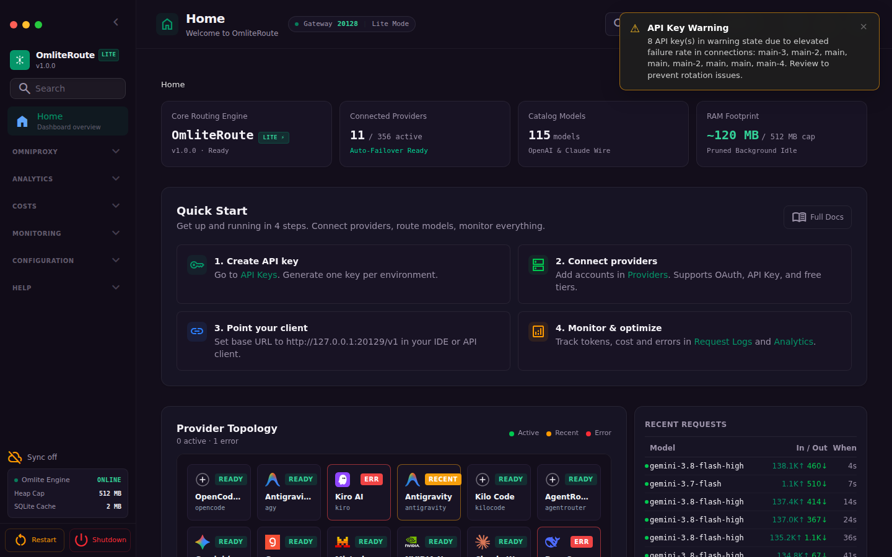
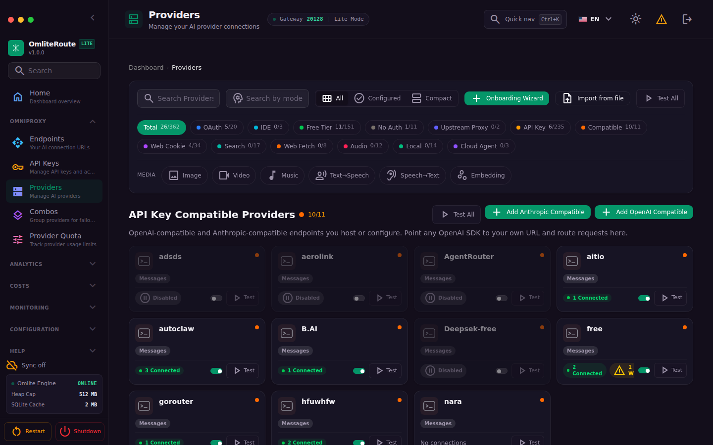
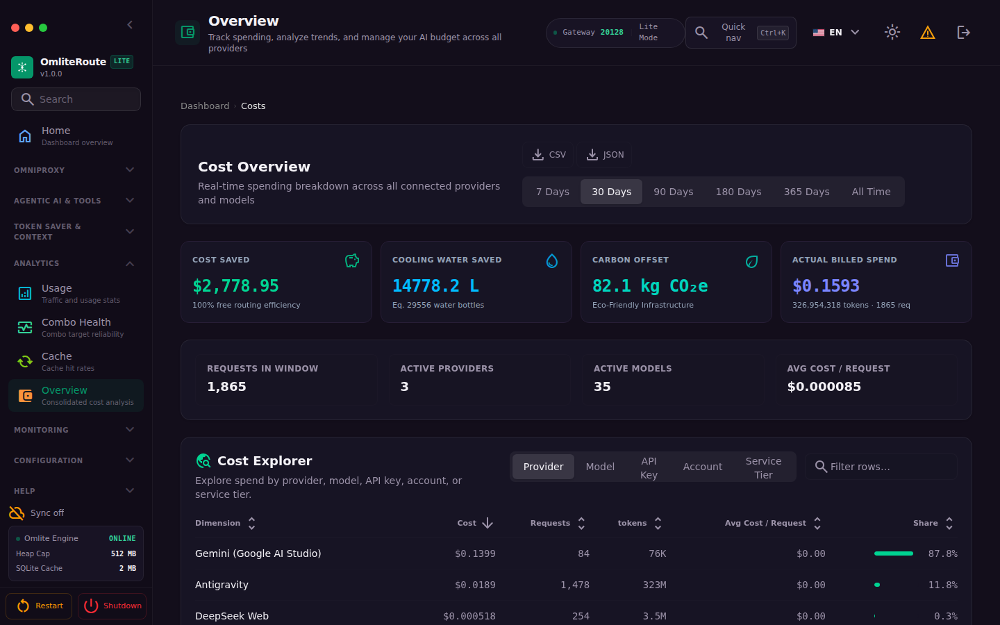

<div align="center">



<br/>
<br/>

# 🪶 OmliteRoute

### The Ultra-Lightweight, Low-RAM AI Gateway & Smart Model Router

**356+ Providers · Auto-Fallback · RTK Compression · Low-RAM (~120MB) · Zero-Bloat**

<br/>

[](https://www.npmjs.com/package/omliteroute)
[](https://www.npmjs.com/package/omliteroute)
[](https://github.com/adamhasani/omliteroute/stargazers)
[](LICENSE)
[](https://github.com/adamhasani/omliteroute/actions)
[](README.md)
[](docker-compose.lite.yml)

</div>

<br/>

```bash
# ⚡ Install globally via npm (Recommended)
npm install -g omliteroute
omliteroute

# Or run instantly without installing
npx omliteroute
```

<br/>

---

## 💡 What is OmliteRoute?

**OmliteRoute** is an independent, hyper-optimized AI proxy and model router engineered specifically for **laptops, low-resource VPSs, and developer workstations**.

Standard AI proxy routers frequently consume **1.5 to 3.0 GB of RAM** and drain battery with background scraping, unmanaged caches, and heavy WebGL animations. **OmliteRoute strips away all non-routing bloatware** while preserving **100% of the core AI routing engine**:

* **One Endpoint for Everything:** Point Claude Code, Codex, Cursor, Cline, OpenCode, Hermes, or standard OpenAI SDKs to `http://localhost:20128/v1`.
* **Zero-Downtime Resilience:** Automatic fallback and account rotation across **356 AI providers** (Claude, GPT, Gemini, DeepSeek, Grok, Kimi, Mistral, Ollama, etc.) whenever rate-limits (HTTP 429) or quota errors occur.
* **Token Compression Built-in:** Native RTK and Caveman prompt compression to save **15% to 85% on token costs**.
* **Featherlight Footprint:** Runs comfortably in **~120–160 MB of RAM** with <1% idle CPU usage.

---

## 📊 Performance Benchmark: Standard Gateway vs. OmliteRoute

| Metric | Standard Gateway | OmliteRoute 🪶 | Efficiency Gain |
| :--- | :---: | :---: | :---: |
| **Server RAM (Idle)** | 600 MB – 1.2 GB | **~120 – 160 MB** | **~75% RAM Reduction** |
| **Server RAM (Under Load)** | 1.5 GB – 3.0 GB | **~250 – 400 MB** | **~85% RAM Reduction** |
| **Browser CPU (Dashboard Tab)** | 15% – 25% *(WebGL canvas)* | **< 1%** *(CSS-only grid)* | **Zero GPU / battery drain** |
| **Database Disk Growth** | Unbounded (100–500+ MB) | **< 10 MB** *(auto-purged)* | **Permanent lean storage** |
| **i18n Payload** | 37.0 MB (42 languages) | **1.5 MB** *(en & id)* | **35.5 MB freed** |
| **Cold Boot Time** | 7 – 12 seconds | **~1.5 seconds** | **5x faster startup** |

---

## ✨ Key Features

### 1. 🚀 Memory-First Architecture
* **Clamped V8 Heap:** Dynamic heap ceiling clamped to **512 MB** (instead of 35% of total system RAM).
* **Active Idle Garbage Collector:** Background watcher triggers `global.gc()` every 60 seconds if memory exceeds 350 MB during idle periods.
* **Lean SQLite Storage:** SQLite cache size clamped from 64 MB down to **2 MB** (`cache_size = -2048`) with 16 MB memory-mapped I/O.
* **Rolling Call Logs:** `call_logs` table automatically caps itself at the **latest 500 records**, preventing database bloat.

### 2. 🌐 356+ Providers & Multi-Account Fallback
* Support for major frontier providers (Anthropic Claude, OpenAI, Google Gemini, DeepSeek, xAI Grok, Moonshot Kimi, Mistral) and local models (Ollama, vLLM, LM Studio).
* **Account Pools:** Add multiple accounts for the same provider; OmliteRoute rotates keys, balances quota, and auto-cools rate-limited accounts.
* **Combos:** Chain multiple models into a single virtual identifier (e.g. `fast-coder` -> Gemini 2.5 Flash -> DeepSeek V3 -> Claude 3.5 Sonnet).

### 3. 🗜️ In-Flight Token Compression
* **RTK Compression:** Prunes tool outputs, terminal logs, and redundant JSON whitespace in agentic loops.
* **Caveman Compaction:** Semantic prompt compaction preserving core reasoning directives while dropping filler tokens.

### 4. 📱 Clean Haute Luxury Dashboard & Telegram WebApp (TWA)
* Minimalist matte dark design (`#130e1b`, cards `#181324`, accents emerald `#059669`).
* **Zero WebGL Canvas:** Home provider topology replaced with a responsive, instant-loading CSS card grid with status pills (`READY`, `ROUTING`, `RECENT`, `ERR`).
* **Telegram-Ready:** Pre-configured CSP and iframe headers allowing the dashboard to open directly as a Telegram WebApp (TWA) without "Internal Server Error" blocks.

---

## 📸 Dashboard & Feature Preview

<table width="100%">
  <tr>
    <td width="50%" align="center">
      <b>⚡ Providers & Accounts Management</b><br/>
      <sub>Grid of 356+ active AI providers, key test statuses, and account rotation</sub><br/><br/>
      
    </td>
    <td width="50%" align="center">
      <b>🌱 Eco & Cost Savings Telemetry</b><br/>
      <sub>Real-time data center cooling water saved, carbon offset, and money saved vs frontier APIs</sub><br/><br/>
      
    </td>
  </tr>
  <tr>
    <td width="50%" align="center">
      <b>🎯 Model Combos & Smart Routing</b><br/>
      <sub>Multi-model fallback chains and auto-routing pipelines</sub><br/><br/>
      
    </td>
    <td width="50%" align="center">
      <b>📱 Mobile View (Telegram WebApp / TWA)</b><br/>
      <sub>Native mobile-responsive layout for Telegram in-app browsing without iframe errors</sub><br/><br/>
      
    </td>
  </tr>
</table>

---

## 🌱 Eco & Real-Time Financial Savings (MyRoute Standard)

OmliteRoute v1.0.1 integrates **real-time environmental and financial telemetry** directly into the Costs and Analytics dashboard, grounded in empirical data center cooling benchmarks:

* **💰 Biaya yang Dihemat (Cost Saved):** Real-time financial ROI calculated against blended frontier model direct API rates ($8.50 / 1M tokens baseline). Track exactly how many dollars your free provider accounts and combos save.
* **💧 Liter Air Terhemat (Cooling Water Saved):** AI data centers consume vast volumes of clean water for cooling high-density GPU clusters (~0.5L evaporated per 20–50 frontier queries). OmliteRoute tracks the literal liters of cooling water conserved via smart routing and caching (e.g. `14,700+ Liters = 29,000+ water bottles`).
* **🌿 Jejak Karbon Dicegah (Carbon Offset):** Quantifies CO₂e emissions prevented by routing through idle capacity, local inference, and cached context windows.
* **⚡ 100% Free Routing Efficiency:** Instant visibility into free vs paid token ratios so you always know your effective cost-per-token is optimized.

---

## 🧭 Complete 3-Tier Developer Navigation

Unlike bloated gateways that bury critical tools behind nested accordion folders, OmliteRoute organizes all developer utilities into **3 clear, high-density tiers**:

1. **Homepage:**
   * **Endpoint & Key (`/dashboard/endpoint`):** Base URL endpoints, tunnels, and root API access keys.
   * **Overview (`/home`):** Executive telemetry strip (Active Providers, Model Catalog, RAM Footprint).
   * **Playground (`/dashboard/playground`):** Test model outputs, streaming speeds, and multi-provider responses.
2. **Gateway:**
   * **Providers (`/dashboard/providers`):** Connect accounts, OAuth tokens, and API credentials across 356+ platforms.
   * **Combo & Vision Adapter (`/dashboard/combos`):** Configure multi-model fallback chains, load-balancing, and multimodal bridges.
   * **Token Saver (`/dashboard/context/settings`):** RTK & Caveman prompt compression rules.
   * **CLI Tools & Orchestration:** Direct command runners, Conductor agents, and task councils.
   * **Skills & Memory:** Persistent agentic memory and tool definitions.
   * **MCP Server (`/dashboard/mcp`):** Model Context Protocol integrations (stdio, SSE, HTTP).
3. **Observe & Tools:**
   * **Usage & Costs (`/dashboard/costs`):** Real-time spend, cost savings, and eco-metrics breakdown.
   * **Quota Tracker (`/dashboard/quota`):** Monitor daily limits, tier resets, and account usage.
   * **Health & Resilience (`/dashboard/health`, `/dashboard/resilience/connections`):** Live circuit breaker and latency monitoring.
   * **Console & Audit Logs (`/dashboard/logs`):** High-speed rolling call logs and event inspectors.
   * **Format Translator (`/dashboard/translator`):** Real-time OpenAI ↔ Claude ↔ Gemini wire-format conversion.

---

## ✂️ What Was Pruned to Make it "Lite"?

OmliteRoute discards all non-essential features that cause memory leaks and CPU thrashing:

1. **Gamification Bypassed:** Zero XP calculations, level-ups, or streak writes on request hot-paths.
2. **15+ Background Pollers Disabled:** No Chatbot Arena ELO sync, live pricing scrapers, models.dev pollers, or live WebSocket daemons waking the CPU.
3. **Monaco Editor Dropped:** Replaced the ~20 MB bundled VS Code editor with a lightweight dark-luxury monospace editor.
4. **Stripped 40 Foreign Languages:** Removed 35.5 MB of unneeded JSON dictionaries, keeping clean English (`en`) and Indonesian (`id`).
5. **Pruned 53 Sidebar Items:** Eliminated unbuilt, dead, or bloated menu items, leaving a tight 7-section core navigation.

---

## 🚀 Quick Start

### 1. Installation

**Method A: Global via npm (Recommended)**
```bash
npm install -g omliteroute
omliteroute
```
*Or run without installing:* `npx omliteroute`

**Method B: 1-Line Universal Script (Linux & macOS)**
```bash
curl -fsSL https://raw.githubusercontent.com/adamhasani/omliteroute/main/install.sh | bash
```

**Method C: Git Clone & Run**
```bash
git clone https://github.com/adamhasani/omliteroute.git
cd omliteroute
npm install
./bin/omliteroute.mjs
```

**Method D: Docker Compose (Alpine ~95MB)**
```bash
docker compose -f docker-compose.lite.yml up -d
```

---

### 2. CLI Command Reference

| Command | Description |
| :--- | :--- |
| `omliteroute` | Starts OmliteRoute Gateway in Lite mode (port 20128) |
| `omliteroute top` | Opens real-time terminal monitor (RAM, health, models, latency) |
| `omliteroute --port <number>` | Runs gateway on a custom port |
| `omliteroute-reset-password` | Resets dashboard admin password directly via terminal |
| `npx omliteroute` | Runs OmliteRoute on-demand without global installation |

---

### 3. Terminal Live Monitoring (`omliteroute top`)

Launch an interactive terminal monitor anytime without opening the browser:
```bash
omliteroute top
```

```text
===============================================================================
🪶 OmliteRoute — Live Terminal Monitor  [Press Ctrl+C to exit]
===============================================================================
  Gateway:      ● ONLINE (http://127.0.0.1:20128)
  Health Ping:  10 ms
  Engine Mode:  Omni Lite ⚡ (V8 heap: 512MB max · Idle GC: Active)
-------------------------------------------------------------------------------
📊 Operational Metrics
-------------------------------------------------------------------------------
  Total AI Models:    953
  SQLite Page Cache:  2 MB (clamped from 64MB)
  Call Logs Rolling:  Active (auto-purged to latest 500 records)
  Background Sched:   Pruned (15+ idle cron loops stopped)
-------------------------------------------------------------------------------
⚡ Core Endpoints Live Verification
-------------------------------------------------------------------------------
  ✔ GET  /api/health            200 OK (Zero-overhead probe)
  ✔ GET  /v1/models             200 OK (Dynamic catalog)
  ✔ POST /v1/chat/completions   Ready (OpenAI / Claude stream)
===============================================================================
```

The web dashboard is live at:
👉 **`http://localhost:20128`**

Default initial login password: **`CHANGEME`** *(or configure via `INITIAL_PASSWORD`)*.

---

## 💻 Connecting Your Tools

OmliteRoute is 100% drop-in compatible with standard OpenAI and Anthropic SDKs.

### cURL
```bash
curl http://localhost:20128/v1/chat/completions \
  -H "Content-Type: application/json" \
  -H "Authorization: Bearer YOUR_API_KEY" \
  -d '{
    "model": "auto",
    "messages": [{"role": "user", "content": "Hello world!"}]
  }'
```

### Python (OpenAI SDK)
```python
from openai import OpenAI

client = OpenAI(
    base_url="http://localhost:20128/v1",
    api_key="YOUR_API_KEY"
)

response = client.chat.completions.create(
    model="auto",
    messages=[{"role": "user", "content": "Write a Python script to sort a list."}]
)
print(response.choices[0].message.content)
```

### Node.js / TypeScript (OpenAI SDK)
```typescript
import OpenAI from "openai";

const client = new OpenAI({
  baseURL: "http://localhost:20128/v1",
  apiKey: "YOUR_API_KEY",
});

const response = await client.chat.completions.create({
  model: "auto",
  messages: [{ role: "user", content: "Explain quantum computing simply." }],
});
console.log(response.choices[0].message.content);
```

### Claude Code CLI
```bash
export ANTHROPIC_BASE_URL="http://localhost:20128"
export ANTHROPIC_API_KEY="YOUR_API_KEY"
claude
```

### Cursor / Cline / Roo Code / OpenCode
Set the OpenAI Base URL in your editor settings:
* **Base URL:** `http://localhost:20128/v1`
* **API Key:** `sk-omlite-...` *(generated in OmliteRoute dashboard -> API Keys)*
* **Model:** `auto` *(or choose any combo/provider model ID)*

---

## ⚙️ Environment Variables

| Variable | Description | Default |
| :--- | :--- | :---: |
| `PORT` | Web dashboard & API port | `20128` |
| `HOSTNAME` | Host address to bind | `0.0.0.0` |
| `OMNIROUTE_LITE` | Enables memory-optimized Lite mode | `1` |
| `OMNIROUTE_MEMORY_MB` | V8 heap ceiling in MB | `512` |
| `INITIAL_PASSWORD` | Default dashboard password | `CHANGEME` |
| `DATA_DIR` | Directory for SQLite database | `~/.omniroute` |

---

## 🐛 Reporting Bugs & Contributing

Found a bug, want a new provider, or have an idea to optimize OmliteRoute further?

* **Open an Issue:** [github.com/adamhasani/omliteroute/issues](https://github.com/adamhasani/omliteroute/issues)
* **Report a Bug:** [Submit a Bug Report](https://github.com/adamhasani/omliteroute/issues/new?template=bug_report.yml)
* **Request a Feature:** [Submit a Feature Request](https://github.com/adamhasani/omliteroute/issues/new?template=feature_request.yml)
* **Security Vulnerabilities:** If you discover a sensitive security vulnerability, please submit it privately via [GitHub Security Advisories](https://github.com/adamhasani/omliteroute/security/advisories/new).

When reporting bugs, running `omliteroute doctor` and attaching the sanitized diagnostic output helps reproduce and patch issues promptly!

---

## 📜 License & Acknowledgments

* **Creator & Maintainer:** [Adam Hasani](https://github.com/adamhasani) ([@adamhasani](https://github.com/adamhasani))
* **Package Registry:** [npmjs.com/package/omliteroute](https://www.npmjs.com/package/omliteroute)
* **GitHub Repository:** [github.com/adamhasani/omliteroute](https://github.com/adamhasani/omliteroute)
* **License:** [MIT License](LICENSE)

<div align="center">

⭐ **Star this repository if OmliteRoute saved your laptop RAM and money!**

</div>
